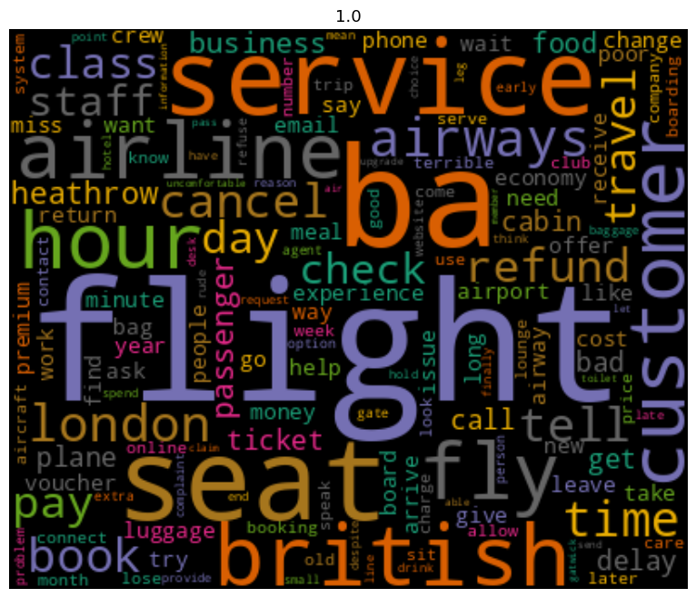
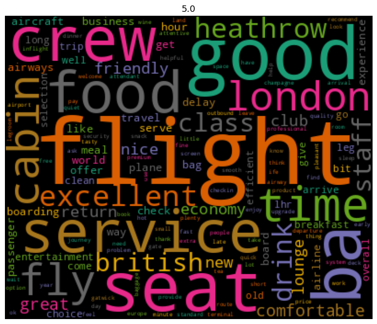

# BA Reviews Analysis
The objective of this project is to leverage data science techniques to analyze customer feedback on British Airways (BA) collected from Skytrax, with the aim of uncovering actionable insights to influence multi-million-pound business decisions and developing a predictive model to forecast customer booking behavior. By scraping, cleaning, and analyzing review data, the project seeks to understand customer sentiments, identify key topics of concern or praise, and provide recommendations that will improve customer experience, reduce costs, and increase revenue. The predictive model will enhance BA's ability to target and convert potential customers, thereby further boosting booking rates and overall revenue.

### Steps Taken 
- Data Scraping using Beautiful Soup
- Data preprocessing 
    - Expanding contracted words
    - Removing punctuation, whitespaces and stopwords
    - Lemmatization
- Exploratory Data Analysis
    - Handling missing values and outliers
    - Univariate analysis, bivariate analysis and text analysis
- Data Visualization
- Model Training
- Model Evaluation

## Project Structure
-   **/data:** Contains the evaluation set and data preparation scripts.
-   **/notebooks:** Contains jupyter notebooks for analysis.
-   **/scripts:** Contains utility scripts.
-   **/requirements.txt:** Lists of dependencies.

## Text Analysis
### Wordcloud for reviews rated 1

### Areas of concern
| Words                                                   | Areas of concern                                       |
|---------------------------------------------------------|--------------------------------------------------------|
| "flight," "delay," "cancel," "board," "seat," "airport" | Flight disruption and experience as a whole.           |
| "staff," "service," "crew," "agent," "help"             | Customer Service                                       |
| "seat," "cabin," "comfort," "legroom"                   | In-flight comfort                                      |
| "price," "cost," "money" and "expensive"                | Pricing                                                |
| "refund," "voucher"                                     | Compensation for flight disruptions or service failures |

### Wordcloud for reviews rated 5

### Areas of praise
| Keywords                          | Areas of Praise                                               |
|-----------------------------------|---------------------------------------------------------------|
| service, crew, staff, friendly    | High-quality customer service and professional, friendly crew  |
| food, meal, breakfast, drink      | Quality and variety of in-flight meals and beverages           |
| seat, cabin, comfortable, legroom | Comfortable seating and overall cabin comfort                 |
| london, heathrow, gatwick         | Smooth experience at specific airports (e.g.Heathrow, Gatwick)  |
| time, hour                        | Efficient handling of time, punctuality                        |
| lounge                            | Positive feedback on airport lounges                          |

## Predictive model
### Feature importances
- The most important variable in the model was purchase_lead, that is the time between purchase and departure.

## Model Performance

### Classification Report
|               | precision | recall | f1-score | support |
|---------------|-----------|--------|----------|---------|
| **Class 0**         | 0.99      | 0.91   | 0.95     | 8513    |
| **Class 1**         | 0.92      | 0.99   | 0.96     | 8496    |
| **macro avg** | 0.96      | 0.95   | 0.95     | 17009   |
| **weighted avg** | 0.96   | 0.95   | 0.95     | 17009   |

**Accuracy**: 0.95 

**ROC AUC Score**: 0.9534

## Acknowledgments

-   Forage and British Airways for offering the job simulation challenge

### License

This project is licensed under the MIT License - see the [LICENSE](LICENSE) file for details.

